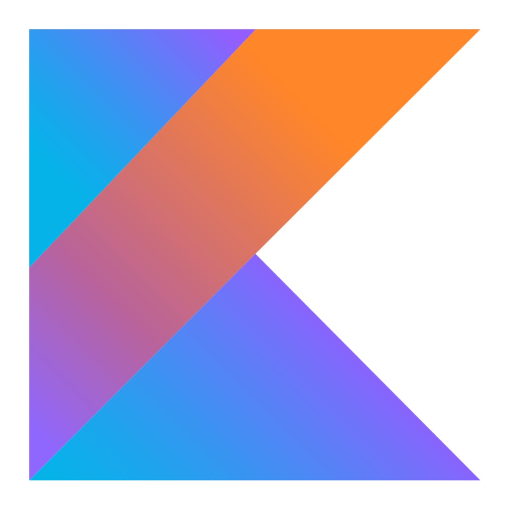

## Hey there 👋, Eray Onur here!
I am a professional Full-Stack Web and Cross-Platform Mobile App Developer who turned his hobby into his profession: building useful software of all sorts! 💻
 
 

<!--  -->
  
### 🧐 More About Me:

- 🔭 &nbsp; I’m currently working on a **top secret b2b/b2c project**...
- 📚 &nbsp; I’m currently learning Domain Driven Design, Microservices and Kubernetes!
- 💎 &nbsp; Some of my projects are available on [Github](https://github.com/eray-onur?tab=repositories).
- 💬 &nbsp; Ask me about anything tech related, I am happy to help.
- 📫 &nbsp; Feel free to ping me on 

### 📊 Github Stats

### 🔨 Languages and Tools:
--- 

#### Programming Languages & Ecosystems

 
 

#### Frontend Development

 
 

#### Mobile Development

 
 

#### Backend Development

 

 

#### Database Development & Management

 

 

#### Continuous Integration & Delivery

 

 

#### Unit/Integration/E2E Testing

 

 

### 🛠️ My Projects
- <a href="https://github.com/eray-onur/zeuserp-webui" target="_blank">Zeus ERP - Frontend (Angular 2+)</a>
- <a href="https://github.com/eray-onur/zeuserp-backend" target="_blank">Zeus ERP - Backend (.NET Core 3.1)</a>
- <a href="https://github.com/eray-onur/image-to-webp-converter" target="_blank">Image to Webp Converter (Node.js / Fastify)</a>
- <a href="https://github.com/eray-onur/reversed-spider-soltaire" target="_blank">Reversed Spider Solitaire (React - Redux)</a>
